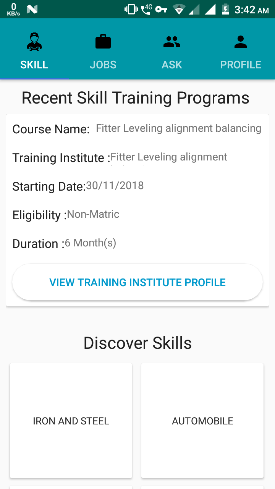

# Smart-Odisha-Hackathon
App to connect local youth with training centres of states as well with companies to learn vocational courses.
The app uses Material Design for UI and Firebase as its backend.

Simply clone the app and run the following in Android Studio.

